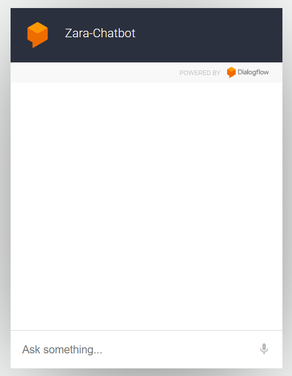
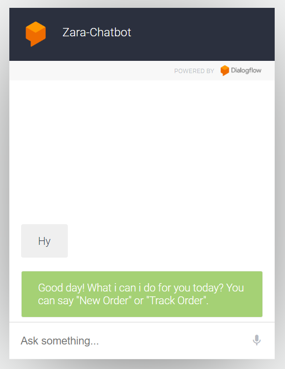
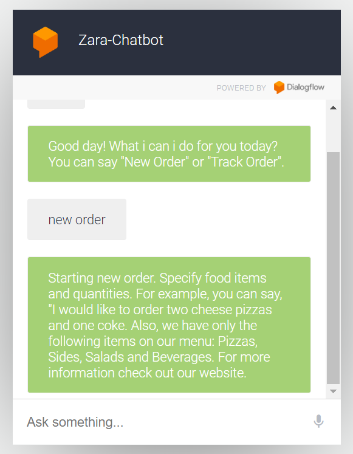

# Zara-Chatbot for Adrien's Pizza Store

## Project Summary

**Objective:**
To enhance customer service at Adrien's Pizza Store by developing an efficient and user-friendly chatbot named Zara-Chatbot. The chatbot is designed to handle order placement, order tracking, and order deletion seamlessly.

**Technologies Used:**
- **Dialogflow:** Utilized for natural language understanding to interpret customer requests and respond appropriately.
- **FastAPI:** Used to build the backend API, ensuring fast and efficient handling of chatbot requests and integration with the store's order management system.

**Demo Images:**

